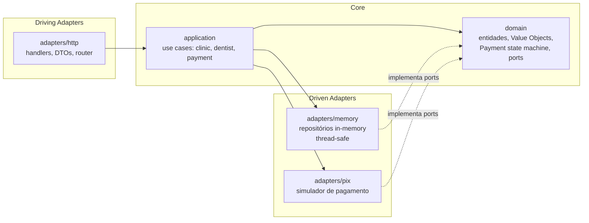
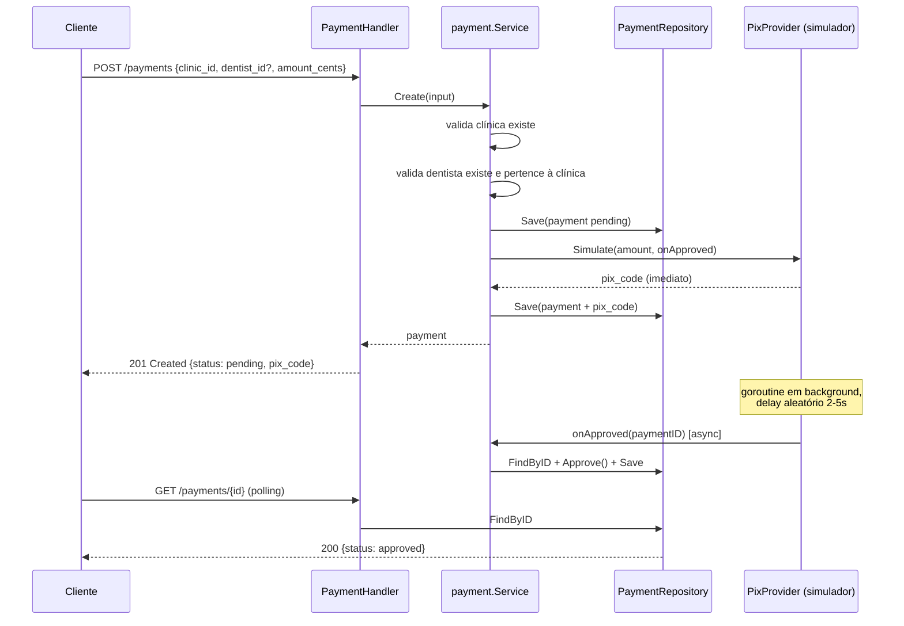

Capim, trabalhamos com clínicas odontológicas e seus respectivos dentistas. A proposta deste
desafio é desenvolver uma aplicação em Go que permita o gerenciamento de registros relacionados
a esses conceitos.

Nesse contexto, seu objetivo é criar uma API para a gestão de clínicas (que chamaremos de Clinics),
possibilitando a criação de uma ou mais clínicas, bem como a administração de seus dentistas,
contas bancárias associadas e pagamentos recebidos.

1. Clínicas
• Deve ser possível criar, alterar, visualizar e excluir uma clínica.
• Informações da clínica: documento (CPF/CNPJ), razão social, nome fantasia.
• Para além das informações básicas, uma clínica tem informações bancárias (banco, conta,
agência). Essas informações também devem ser passíveis de alteração.

2. Dentistas
• Dentistas são atrelados, necessariamente, a uma clínica.
• Informações do dentista: nome, telefone, email.
• Uma clínica pode ter um ou mais dentistas como administrador e responsável legal da
clínica.

3. Pagamentos (Pix) - OPCIONAL
• Uma clínica (Clinic) deve poder receber pagamentos via Pix.
• Endpoint: POST /payments — recebe clinic_id, valor e dentist_id (opcional). Retorna um
identificador de cobrança e um código Pix copia-e-cola simulado.
• O pagamento deve ter um ciclo de status: pending → approved.
• Não é necessária integração com um provedor real. Simule a confirmação: por exemplo,
um processo em background que, após um tempo aleatório (ex: 2–5s), atualiza o status do
pagamento para approved.

Requisitos Técnicos (Obrigatório)
• O desafio deve ser executado usando Go, usando quaisquer pacotes que você julgar
úteis/necessários.
• O código deve ser bem documentado e seguir boas práticas de programação.
• Incluir testes unitários e de integração, cobrindo cenários de sucesso e erro.
• As camadas de serviço/negócio devem usar implementações fake/mock das interfaces, sem
depender de um banco ou serviço externo real rodando.
• Utilize banco de dados in-memory, não há necessidade de ter uma implementação real com
algum serviço de banco de dados.

Critérios de Avaliação
Critério O que avaliamos
Funcionalidade O sistema funciona? A lógica está correta? É possível criar e alterar

informações de uma clínica? E dos membros?

Organização do
Código

Separação entre lógica e interface da API. Naming claro. Estrutura
coerente de arquivos e módulos.

Testes Testes cobrindo cenários de sucesso e erro, usando mocks/fakes das

interfaces de persistência e do provedor de pagamento.
Interface A interface da API é intuitiva? Seria fácil integrar essa API em um

front-end?

Justificativa Técnica Capacidade de explicar e defender as decisões tomadas, tanto

técnicas quanto de produto, ao longo do desenvolvimento da solução.

---

# API de Gestão de Clínicas — Documentação Técnica

> As seções abaixo (a partir daqui) são a documentação da implementação, escrita por quem
> desenvolveu a solução. O texto acima é o enunciado original do desafio.

## Sumário

- [Como executar](#como-executar)
- [Documentação da API](#documentação-da-api)
- [Arquitetura](#arquitetura)
- [Justificativa técnica](#justificativa-técnica)
- [Compile-time interface assertions](#compile-time-interface-assertions)
- [Decisões de design notáveis](#decisões-de-design-notáveis)
- [Estrutura de pastas](#estrutura-de-pastas)
- [Testes](#testes)
- [Fora de escopo](#fora-de-escopo)

## Como executar

Pré-requisitos: Go 1.23+ (para rodar localmente) ou Docker + Docker Compose (para rodar em
container).

```bash
# Localmente
go run ./cmd/api                # sobe em :8080 por padrão
make run                        # equivalente via Makefile

# Testes
make test                       # go test ./... -v
make test-race                  # go test ./... -race (detecção de data races)
make lint                       # golangci-lint run ./...

# Build
make build                      # gera ./bin/api

# Docker
make docker-up                  # docker compose up --build (API em :8080)
make docker-build               # apenas build da imagem
```

Variáveis de ambiente (todas opcionais, com defaults sensatos — ver
`internal/platform/config/config.go`):

| Variável | Default | Descrição |
|---|---|---|
| `PORT` | `8080` | Porta HTTP do servidor |
| `OPENAPI_PATH` | `api/openapi.yaml` | Caminho do arquivo servido em `/openapi.yaml` |

## Documentação da API

Com o servidor rodando:

- **Swagger UI**: [http://localhost:8080/docs](http://localhost:8080/docs) — interface visual e
  interativa para explorar/testar todos os endpoints.
- **Contrato OpenAPI 3.0**: [http://localhost:8080/openapi.yaml](http://localhost:8080/openapi.yaml)
  (também disponível estaticamente em [`api/openapi.yaml`](api/openapi.yaml)) — inclui todos os
  request/response schemas e os códigos de erro possíveis (`404`, `409`, `422`) por endpoint,
  para facilitar a integração de um front-end.

Todas as rotas ficam sob o prefixo `/api/v1` (ex: `POST /api/v1/clinics`).

**Postman**: importe [`postman/capim-clinicas.postman_collection.json`](postman/capim-clinicas.postman_collection.json)
para testar todos os endpoints manualmente ou rodar a coleção inteira via Collection Runner —
as pastas (`Clinics` → `Dentists` → `Payments` → `Error Scenarios` → `Cleanup` → `Docs`) capturam
os IDs criados automaticamente em variáveis da coleção e os reutilizam nas requisições seguintes,
então a coleção inteira roda de ponta a ponta sem edição manual. Ela também cobre os cenários de
erro documentados no OpenAPI (`404`, `409`, `422`), incluindo as validações cross-aggregate
descritas na seção [Decisões de design notáveis](#decisões-de-design-notáveis). Validado com
`newman run postman/capim-clinicas.postman_collection.json` (27 requisições, 41 assertions, 0
falhas).

## Arquitetura

A solução segue **Arquitetura Hexagonal (Ports & Adapters)**, com elementos
pontuais de DDD tático (Value Objects para `Document` e `Money`, uma pequena máquina de estados
para `Payment`) — sem ir até agregados/bounded contexts formais, que seriam desproporcionais ao
escopo de 3 entidades e um fluxo de pagamento.



Todas as setas de dependência apontam para dentro, em direção ao `domain`, que não conhece HTTP
nem detalhes de storage. `domain` define **ports** (interfaces como `ClinicRepository`,
`PixProvider`); `adapters/memory` e `adapters/pix` são implementações concretas (**driven
adapters**) injetadas via construtor em `cmd/api/main.go` (composition root); `adapters/http` é
quem "entra" na aplicação (**driving adapter**). Trocar o storage in-memory por Postgres, ou o
simulador de Pix por uma integração real, afeta só o adapter correspondente — o domínio e os use
cases permanecem intocados.

### Fluxo de um pagamento Pix



## Justificativa técnica

### Por que Hexagonal/Clean em vez de alternativas

| Critério | Camadas simples (handler→service→repo) | **Hexagonal/Clean (escolhida)** | DDD tático completo |
|---|---|---|---|
| Separação lógica ↔ interface | Parcial — services acessam infra diretamente | Total — domínio não conhece HTTP nem storage | Total, com camadas extras |
| Uso de fakes/mocks nas camadas de negócio (requisito obrigatório do desafio) | Possível, mas interfaces tendem a vazar detalhes de infra | Natural — ports já são a interface a mockar | Natural, mas com mais interfaces que o necessário |
| Complexidade para o escopo (3 entidades + 1 fluxo) | Baixa | Média | Alta |
| Trocar storage in-memory → Postgres depois | Requer refatoração em vários pontos | Troca só o adapter | Troca só o adapter |
| Risco de over-engineering | Baixo | Baixo-médio | Alto |

O requisito obrigatório do desafio — *"as camadas de serviço/negócio devem usar implementações
fake/mock das interfaces, sem depender de um banco ou serviço externo real"* — já é, na prática,
uma descrição do padrão Ports & Adapters: o domínio define interfaces que tanto implementações
reais quanto fakes satisfazem. DDD tático completo resolveria o mesmo problema, mas com aparato
(agregados, domain events, bounded contexts) desproporcional a este domínio — um risco real de
over-engineering que pesa negativamente na avaliação de "Organização do Código".

### Outras decisões e motivos

| Decisão | Escolha | Motivo |
|---|---|---|
| Escopo do Pix | Implementado por completo (não apenas o CRUD obrigatório) | Demonstra profundidade técnica: concorrência, worker assíncrono, state machine |
| Framework HTTP | `net/http` da stdlib (Go 1.23+, `ServeMux` com path params) | Zero dependências externas, demonstra domínio da stdlib |
| Documentação da API | OpenAPI 3.0 + Swagger UI servido pela própria API | Padrão de mercado; facilita diretamente o critério "Interface" |
| Versionamento | Prefixo de URL `/api/v1` | Simples, explícito, permite evolução sem quebrar clientes |
| IDs | UUID v4 gerado na aplicação | Desacoplado do storage, sem colisão, padrão em sistemas distribuídos |
| Testes | `testing` (stdlib) + `testify` (assert/require) + fakes hand-rolled | Legibilidade; fakes evitam acoplar testes a uma lib de mock específica |
| Tooling | Makefile, Dockerfile, docker-compose, golangci-lint, GitHub Actions CI | Facilita avaliação (`make run`/`make test`) e demonstra maturidade de entrega |

## Compile-time interface assertions

Cada adapter que implementa um port (`internal/adapters/memory/*_repository.go`,
`internal/adapters/pix/simulator.go`) traz uma linha como esta logo após a declaração do tipo:

```go
// Compile-time assertion that *ClinicRepository satisfies clinic.Repository.
var _ clinic.Repository = (*ClinicRepository)(nil)
```

**Como funciona**: `(*ClinicRepository)(nil)` é um ponteiro nulo do tipo `*ClinicRepository` — não
aloca nada. Atribuí-lo a uma variável do tipo da interface (`clinic.Repository`) força o
compilador a checar, ali mesmo, se `*ClinicRepository` implementa todos os métodos do port com as
assinaturas corretas. O identificador em branco (`var _ = ...`) garante que nenhuma variável real
é criada — a linha é *dead code* eliminado no binário final, **custo zero em runtime**.

**Por que adicionamos, mesmo não sendo estritamente necessário hoje**: Go já é estaticamente
tipado, então se um adapter quebrasse o contrato do seu port, `cmd/api/main.go` já não compilaria
na chamada que passa esse adapter para o `NewService(...)` — o compilador pegaria o erro de
qualquer forma. O que essa linha melhora é *onde* e *quão rápido* esse erro aparece:

- **Falha localizada**: sem a assertion, esquecer de implementar um método novo do port só
  aparece como erro de compilação lá em `main.go`, longe de onde a mudança foi feita. Com a
  assertion, o erro aparece imediatamente no próprio arquivo do adapter (a IDE já sublinha em
  vermelho ali), sem precisar compilar o pacote `main`.
- **Documentação de intenção**: Go usa *structural typing* — não existe uma sintaxe de
  `implements` como em Java/TypeScript. Essa linha deixa explícito, ao lado do tipo, "isto deveria
  implementar aquele port", verificado pelo compilador em vez de viver só como comentário.
- **Cresce bem com o projeto**: hoje temos poucos adapters (`memory`, `pix`); se um dia surgir
  `adapters/postgres/clinic_repository.go` (ver seção de arquitetura acima) ou qualquer outro
  adapter novo, o padrão já está estabelecido e o custo de manter é uma linha por arquivo.

**Quando ela é realmente indispensável** (não é o nosso caso hoje, mas vale ter em mente): quando
o tipo concreto só é usado através de `any`/`interface{}`, reflection, ou um registry (ex:
selecionar o adapter de persistência por uma string vinda de config/env, guardado num
`map[string]any` e convertido de volta com um *type assertion* em outro lugar do código). Nesse
cenário, **sem** a assertion, uma implementação quebrada compilaria normalmente e só falharia como
**panic em runtime**, exatamente no momento do type assertion — potencialmente em produção. Se a
composition root de `main.go` algum dia evoluir para algo assim (plugins, seleção dinâmica de
adapter por variável de ambiente, DI baseado em reflection), essas assertions deixam de ser só
documentação e passam a evitar um bug real que só apareceria em runtime.

## Decisões de design notáveis

- **DTOs em `adapters/http/dto/`, nunca junto do domínio**: `ClinicResponse`, `DentistResponse`,
  `PaymentResponse` etc. vivem num pacote dedicado, separado tanto de `internal/domain/*` quanto
  dos handlers. Entidades de domínio (`Clinic`, `Dentist`, `Payment`) carregam comportamento e
  invariantes de negócio (`Clinic.UpdateInfo`, `Payment.Approve`); DTOs são apenas dado com tags
  `json`. Misturar os dois — por exemplo, num pacote genérico `models/` — tende a criar a
  tentação de expor a entidade de domínio direto como resposta HTTP, acoplando o contrato público
  da API a detalhes internos (ex: o Value Object `Document` teria que ganhar tags `json` para ser
  serializado, contaminando o domínio com uma preocupação de transporte). O conversor
  `dto.ToClinicResponse` existe exatamente para isolar essa tradução na fronteira. O pacote `dto`
  foi extraído para uma subpasta (em vez de arquivos soltos em `adapters/http`, como no início do
  projeto) pensando no crescimento da API: à medida que endpoints/DTOs aumentarem, ter um único
  lugar óbvio para "o contrato de rede de cada recurso" facilita revisão e onboarding, sem exigir
  nenhuma mudança em `domain` ou `application`.

- **Cópia defensiva nos repositórios in-memory**: `Save`/`FindByID`/`FindAll` em
  `adapters/memory` sempre operam sobre cópias, nunca sobre o ponteiro vivo guardado no `map`.
  Sem isso, uma leitura concorrente com a aprovação assíncrona de um pagamento (ou duas escritas
  concorrentes) causaria uma data race real — confirmado empiricamente e coberto por testes
  dedicados (`Test*Repository_FindByID_ReturnsDefensiveCopy`) e por `go test -race` na CI.
- **Validação cross-aggregate em pagamentos**: `POST /payments` valida não só que `clinic_id` e
  `dentist_id` existem individualmente, mas que o dentista informado **pertence** à clínica
  informada (`422` caso contrário) — evita associar uma cobrança a um dentista de outra clínica.
- **Exclusão de clínica com dentistas vinculados é bloqueada** (`409 Conflict`): em vez de
  cascatear a exclusão (o que apagaria silenciosamente dentistas e possivelmente pagamentos
  associados) ou permitir órfãos, a API exige que os dentistas sejam removidos/realocados antes
  de excluir a clínica — uma escolha explícita e mais segura por padrão.
- **CPF/CNPJ é imutável após a criação**: `Document` é um Value Object sem método de atualização;
  o endpoint de atualização de clínica só altera razão social e nome fantasia (dados bancários
  têm endpoint próprio). Um documento fiscal não deveria mudar depois de emitido; se a clínica
  errou o documento, o fluxo esperado é uma nova clínica, não uma edição silenciosa.
- **Callback de aprovação do Pix falha silenciosamente por design**: `onApproved` (chamado pelo
  simulador numa goroutine em background) não tem um request context nem uma forma de reportar
  erro de volta — o contrato do `PixProvider` (`func(paymentID string)`, sem retorno de erro) é
  intencional para manter o domínio agnóstico de como a confirmação chega.

## Estrutura de pastas

```
cmd/api/                      # composition root — wiring manual, start do servidor HTTP
internal/
  domain/{clinic,dentist,payment}/   # entidades, Value Objects, ports — zero I/O, zero framework
  application/{clinic,dentist,payment}/  # use cases — orquestram o domínio via ports
  adapters/
    http/                     # driving adapter: handlers, middleware, router, Swagger UI
      dto/                    # request/response (wire format) por entidade + conversores de/para domain
    memory/                   # driven adapter: repositórios in-memory thread-safe (mutex)
    pix/                      # driven adapter: simulador do provedor Pix
  platform/{config,apperrors}/     # infraestrutura transversal
api/openapi.yaml               # contrato OpenAPI — fonte da verdade da API
test/integration/              # testes ponta a ponta via httptest.Server
```

## Testes

```bash
make test        # unitário, verbose
make test-race   # com detector de data races
go test ./... -cover   # cobertura por pacote
```

- **Domínio**: testes unitários puros (sem mocks — funções determinísticas).
- **Application (use cases)**: fakes hand-rolled dos ports, cobrindo caminho feliz e cada erro de
  negócio (`404`, `409`, `422`), sem depender de banco ou serviço externo real.
- **Adapters HTTP**: via `httptest`, validando contrato (status code, corpo JSON) por endpoint.
- **Integração**: sobe o router completo com adapters in-memory reais e bate via
  `httptest.Server`, incluindo o fluxo assíncrono do Pix (`pending` → `approved` via polling com
  `assert.Eventually`).

## Fora de escopo

- Autenticação/autorização (não mencionada no desafio).
- Persistência real (Postgres etc.) — banco in-memory é requisito explícito do desafio.
- Integração real com provedor Pix — simulação é requisito explícito do desafio.
- Proteção contra *lost update* em edições concorrentes do mesmo recurso (o mutex dos
  repositórios evita data races de memória, mas duas requisições `PUT` concorrentes ainda podem
  se sobrescrever uma à outra — resolveríamos com um campo de versão/ETag numa iteração futura).
- **Multi-tenancy** (isolamento de acesso/dados entre organizações). Vale distinguir de
  **multi-clínica**, que a API já suporta: `POST /clinics` permite criar quantas clínicas forem
  necessárias, cada uma com seus próprios dentistas e pagamentos via `clinic_id`. O campo
  `Dentist.IsAdmin` ("um ou mais dentistas como administrador e responsável legal da clínica")
  é metadado de negócio — descreve um papel dentro da clínica — e não um mecanismo de controle de
  acesso; hoje ele não governa nenhuma decisão de autorização no código. Multi-tenancy de fato
  (ex: "um dentista só pode ver/alterar dados da própria clínica") exigiria autenticação para
  sequer definir "quem está chamando", e autenticação está fora de escopo. Implementar isolamento
  sem uma identidade real verificável daria uma falsa sensação de segurança, então optamos por não
  simular nenhuma das duas. Dito isso, o domínio já está com o "formato" propício para isso: como
  `ClinicID` já é chave estrangeira em `Dentist` e `Payment` (com `FindByClinicID` já existente nos
  repositórios), adicionar essa restrição depois — quando/se autenticação existir — seria uma
  mudança isolada na camada de autorização, sem redesenhar `domain` ou `application`.
- Internacionalização, rate limiting avançado.